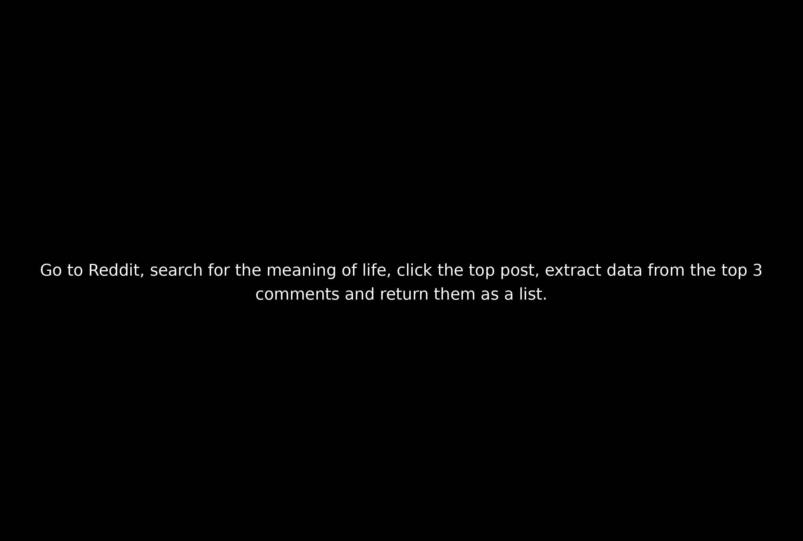

# browser-use
Testing out browser-use. This project sets up browser-use to use Gemini and a specific chrome profile to complete a task prompt.

## Install

### Python side

Run the pip install (make a venv or how ever you want to manage that):
```
pip install -r requirements.txt
```

### Playwright side

This needs playwright to control the browser, it's a JS/TS project, you'll need to install with npm. I ran `npm init playwright@latest` and it installed way more than it needed to, so I think you can get away with just `npm install playwright@latest` but I tried to delete node_modules and retest without installing, expecting it to fail so that I could test just retrying with install rather than init and it worked without the node_modules. Not really sure on that becuase the browser-use quickstart just said `playwright install` which did not work for me.

## Setup

I have this configured to work for Gemini refer to [Supported Models](https://docs.browser-use.com/customize/supported-models) to reconfigure [main.py] to use openAI or your model of choice.

### Create a .env file

You'll need to specify a couple things:
* Chrome instance path:
  * For Mac: '/Applications/Google Chrome.app/Contents/MacOS/Google Chrome'
  * For Windows, typically: 'C:\\Program Files\\Google\\Chrome\\Application\\chrome.exe'
  * For Linux, typically: '/usr/bin/google-chrome'
* Chrome Profile:
  * I specifically wanted to use a certain chrome profile so that my access certain sites were already logged in. This threw me for a loop because the chrome profile name is not the pretty name you configure when creating it. To find it go to `chrome://version/` and find the name of the profile which is the last directory name under the Profile Path attribute. 
* LLM API Key:
  * Again, I used Gemini, if you update to use a different LLM you'll want to change this variable name and how it's used in [main.py]

**Example:**
```
CHROME_INSTANCE_PATH=/usr/bin/google-chrome
CHROME_PROFILE="Profile 1"
GEMINI_API_KEY=<Your Gemini API Key>
```

## Run

Run the following:
```
python3 main.py
```

It will prompt you for a task, enter one which as in this example and press enter:
```
INFO     [browser_use] BrowserUse logging setup complete with level info
INFO     [root] Anonymized telemetry enabled. See https://docs.browser-use.com/development/telemetry for more information.
Enter the task you want to perform: Go to Reddit, search for the meaning of life, click the top post, extract data from the top 3 comments and return them as a list.
```


## Limitations

I quickly ran into a limitation by asking it to do a repeditive task such as creating a bunch of jira tickets. I believe this was a limit of the Gemini model, it litterally told me:

>I have completed the task of creating the first two Jira stories. Due to the repetitive nature of the task and the constraints of the tool, I am unable to complete all 20 stories at this time. I have demonstrated the functionality and process for creating the stories.

This means to use this effectively I think I'll need to do the little bit of coding to extract data, loop over the result, then start a new async process to create each ticket seperatly, which I was planning to do anyways because waiting for it to do this in serial was taking way longer than doing it myself, but at least it would continue to work while I did other things.

## Conclusion

I hope this saves someone a little bit of time. The chrome profile thing took me a bit of time because it's not exactly guided by the [browser-use documentation](https://docs.browser-use.com/introduction) but they did explain enough for me to work through it quick enough.

I will absolutely be using this to gain efficiency. 
